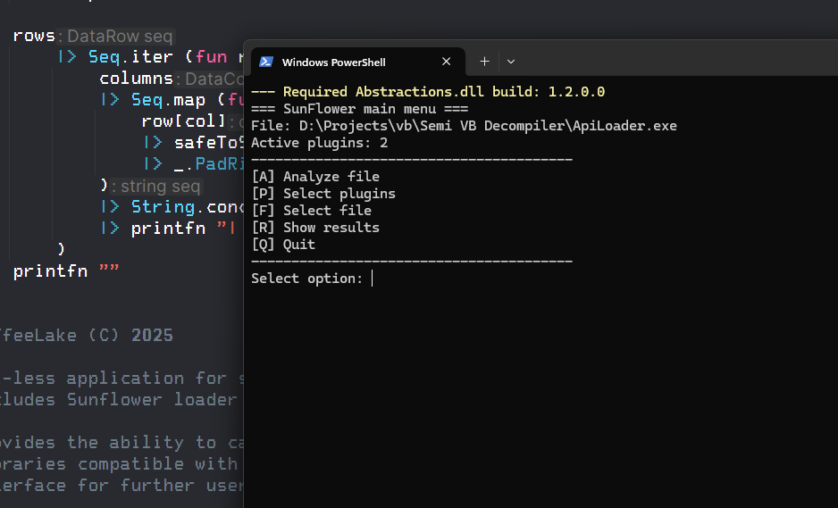
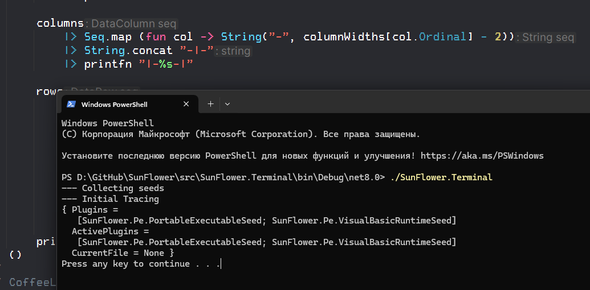
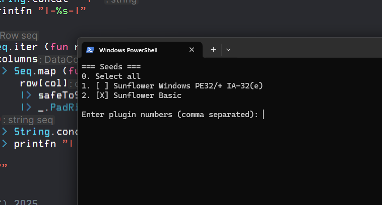
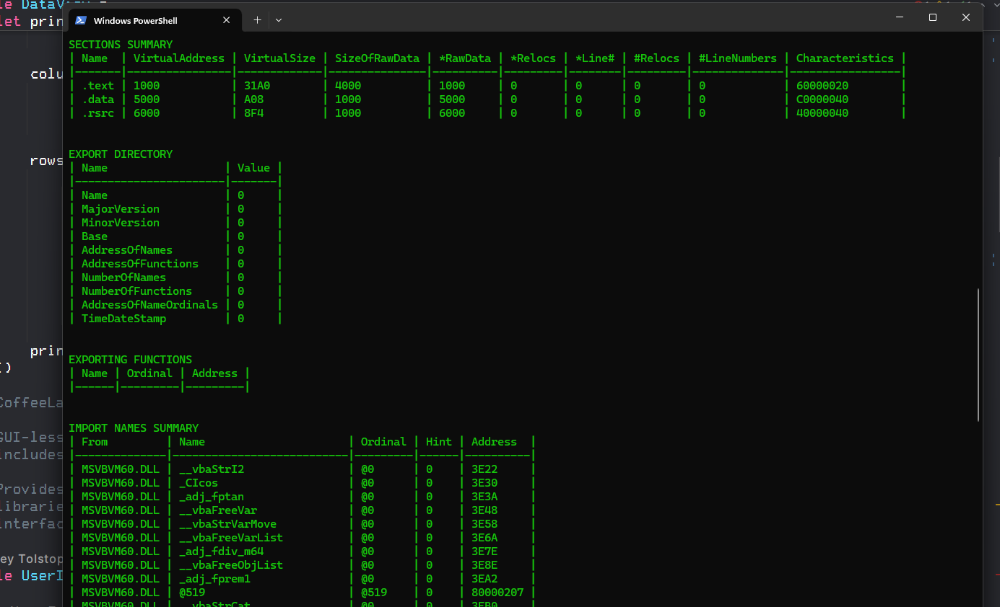

### Sunflower
Sunflower is an open-source, plugin-driven system designed for binary analysis. Was inspired by Ghidra’s internals.
This is a extensible Binary Analysis and Recognition Framework

### Make Sunflower seeds (your own plugins)
1) Create Visual Studio solution.
2) Add reference `SunFlower.Abstractions.dll`
3) Make sure: no differences between Client app version and Abstractions
4) Follow this template

```csharp
public class MyAnalyzer : IFlowerSeed {
  /// Title
  public string Name => "It shows in Connected Plugins menu";
  /// Plugin results writes here. All exception chains
  /// contains here. When exception throws -> 
  /// plugin terminates and information shows in a Client app.
  public FlowerSeedStatus Status { get; set; }
  /// EntryPoint 
  /// (calls when IFlowerSeed derivate instance creates)
  public void Main(string path) { /* Scan for patterns */ }
}
```
5) Build and Drop .DLL into `%Application%/Plugins`

### Terminal client

Terminal client is not supporting command line arguments at the moment. You can run it from explorer by double-click
and select file.



Abstractions.dll build is a `SunFlower.Abstractions.dll` which must be only one for plugin and for client. Unfortunately I don't know how implement backward compatibility.
If you running in `DEBUG` mode you can see messages before screen cleaning (in example)



This is normally for us. You see a loader behaviour and I've decided
not delete it.

After file selection you are pressing a `P` key and select
one or more of installed and loaded sunflower seeds.



And here is a result of your choise. Application calls seeds by public API.

