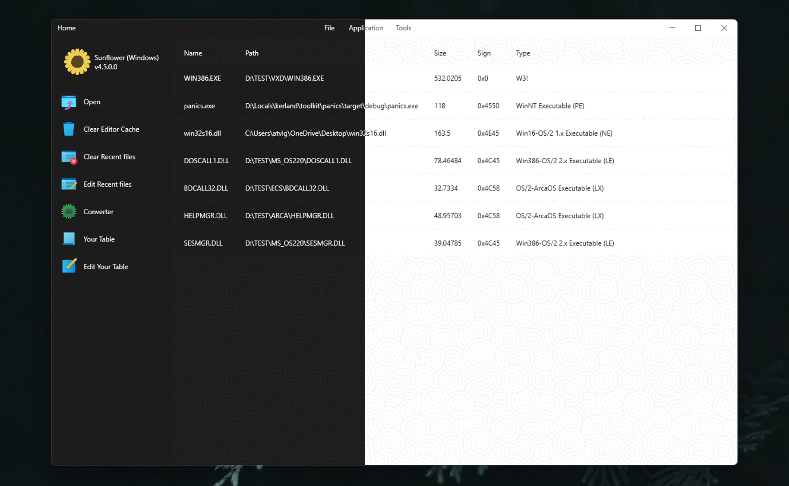
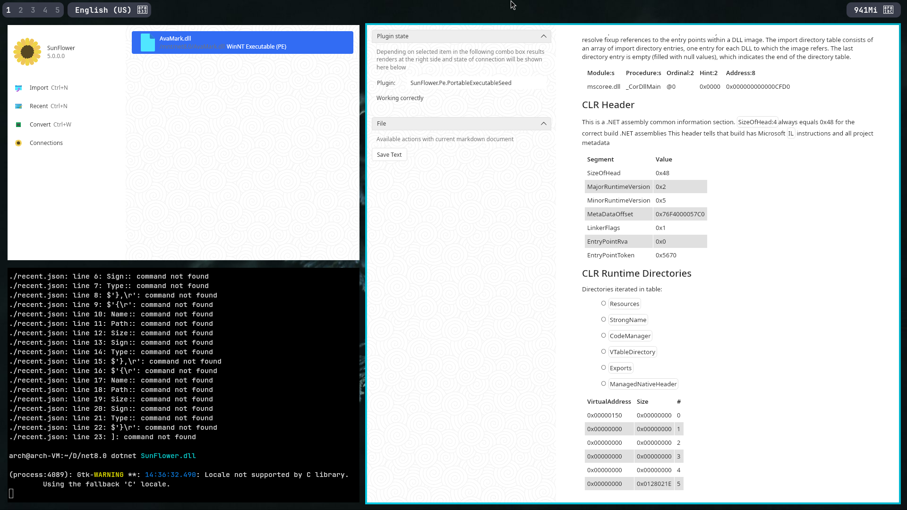

### Sunflower


Sunflower is an open-source, plugin-driven system designed for binary analysis. 
Was inspired by PEAnathomist, CFFExplrer, Semi VB Decompiler, and other same toolkits. 
Main idea of it - make non-monolith application and avoid embedded functions. This repository contains
just loader details and the client.   

This repository includes tree parts of my work:
 - Base definitions (`abstractions`) 
 - Plugins manager (`kernel`)
 - Avalonia Client (`client`)

> [!NOTE]
> Sources of plugins contains in [SunFlower.Plugins](https://github.com/AlexeyTolstopyatov/SunFlower.Plugins/) repository
> and not depend on this reporsitory life



### Sunflower core "seeds" (plugins)

In releases always will be represented plugins for definition
 - `MZ` Executables (real-mode x86 applications);
 - `NE` segmented Executables (first protected-mode x86 applications);
 - `LE` OS/2-Windows386 executables; 
 - `LX` OS/2-ArcaOS standard executables;
 - `PE` Windows NT stndard applications;
 - `MS-DOS PIF files.

But you sunflower gives a chance to make your own extension of it and
run it with all plugins too.

### Sunflower "seeds" (application plugins)

For making new sunflower extension:
1) Create Visual Studio solution.
2) Add reference `SunFlower.Abstractions.dll`
3) Make sure: no differences between Client app version and Abstractions
4) Follow this template
5) Read documents at the end of "README".

```csharp
[Flower(SeedTarget.Data)]
[FlowerContract(5, 0, 0)]
public class MyAnalyzer : IFlowerSeed {
  /// Title
  public string Name => "It shows in Connected Plugins menu";
  /// Plugin results writes here. All exception chains
  /// contains here. When exception throws -> 
  /// plugin terminates and information shows in a Client app.
  public FlowerSeedStatus Status { get; set; }
  /// EntryPoint 
  /// (calls when IFlowerSeed derivate instance creates)
  public int Main(string path) { /* Scan for patterns */ }
}
```

If you want use F# toolchain you can implement it like this:

```fsharp
[<Flower(SeedTarget.Code)>]
[<FlowerContract(5, 0, 0)>]
type MyAnalyzer() =
  interface IFlowerSeed with
  /// Title
  member this.Name = "It shows in Connected Plugins menu"
  /// Plugin results writes here. All exception chains
  /// contains here. When exception throws -> 
  /// plugin terminates and information shows in a Client app.
  member val Status = FlowerSeedStatus() with get, set
  /// EntryPoint
  /// (calls when IFlowerSeed derivate instance creates)
  member this.Main(path: string) : int = 
    // Scan for patterns
    0
```

6) Build and Drop .DLL into `%Application%/Plugins`
7) Run SunFlower and see what you can!



### Supported Binary Formats

Out-of-box DLLs are in [plugins](https://github.com/AlexeyTolstopyatov/SunFlower.Plugins/) repo

### An architecture problems that seriously bother me, but I can't fix them

 - **Stupid** Exceptions handling -
A `Main` procedure contains exceptions handler which
rewrites Status last error field. Loader prints all stack frames of calling assembly;
 - Versions incompatibility - Unfortunately Sunflower plugins which are differ the foundation are **incompatible**.
Any differences between foundation file version and plugins foundation calls force exit (means conflict behaviour).

### Frameworks And other external toolchain

All frameworks and toolkits
 - Avalonia XPF `.net8.0` - Foundation of crossplatform client
 - `.NET 8.0` - Foundation of everything
 - [HandyControls](https://github.com/HandyOrg/HandyControl) - better Window controls / little MVVM experience
 - [Markdown.Avalonia](https://github.com/whistyun/Markdown.Avalonia) instead of Monaco Editor and JavaScript bindings

> [!TIP]
> At the moment of publishing Sunflower the `HandyControl`s not supports
> Avalonia. In the `/external` directory exists experimental assembly of 
> HandyControls for Avalonia.

### Documents
 - [Plugins development notes](ABSTRACT.md) - first stages & abstractions application
 - [Client-Kernel communication notes](KERNEL.md) - how the SunFlower kernel works
 - [Versioning notes](VERSIONING.md)
