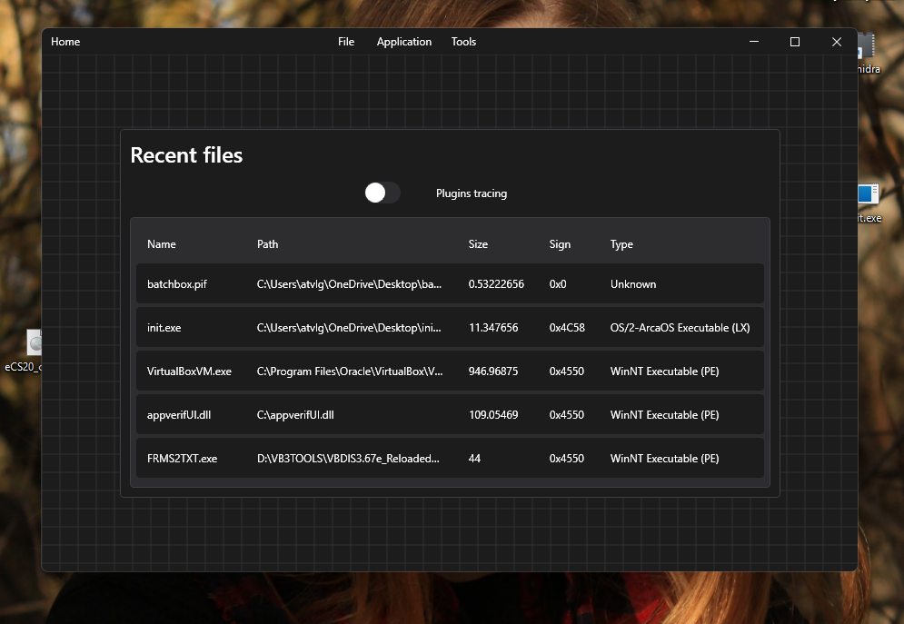
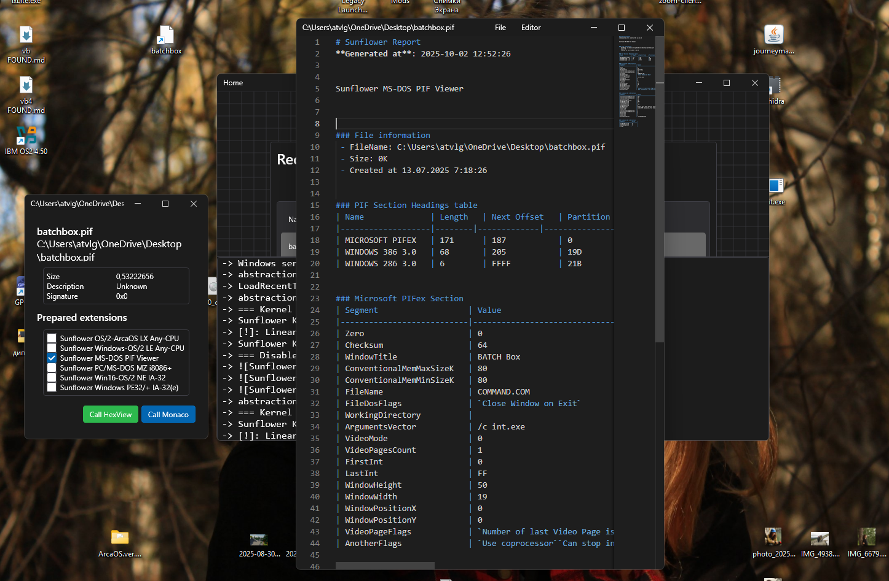
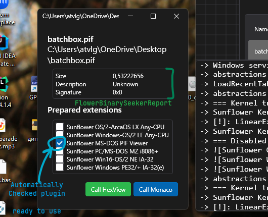
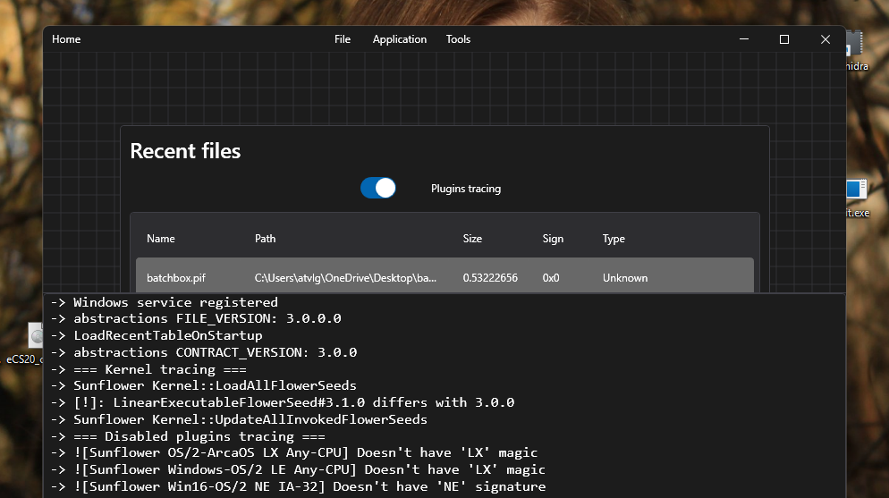

# Sunflower GUI

## Shorten manual | no details 

I made a bigger focus on this part than on the console version of the client, because I am more friendly with the window interface, to be honest. However, the main support for output and processing results is there and there.

In a window variation of the client, the main window is the recently opened files window. If the table is empty, you can open the file from the menu `File->Read Executable` or catch the process `File->Catch Win32 Process`. These actions will add your selected file to the table.



The table of recent files is contained in the directory of the registry  `... Registry\recent.json`, and can be easily supplemented by your notes.

When the file is selected, the uploader starts to check for plugins in the home directory of the `...\Plugins` and marks the ready-to-use files in a special properties window.
From the properties window, to know the results of extensions work, you should call the editor, because there will be written from memory the expected information. 



So, you can save results to file `File->Save document` or ~~manually~~ clean a WebView cache (see main window menu) `Application->Clear Editor Cache`.

All extensions in list (see property window) are ready to use (compatible with sunflower loader). You can manually enable or disable what you want to see it in results document.

> [!WARNING]
> Disabling plugins in list directly changes plugins`Model` part,  but doesn't unload them from RAM. (unfortunately).

Second bad thing is themes. Application supports themes if runs under Microsoft Windows 10 and above, but

> [!WARNING]
> You can't change theme manually, because I gave up to fix Application resources dictionary.

Also Accent colors you can't change too. App uses system setup...

## Manual | Details of Sunflower client
This section describes the usage details of all components connected to
client instance.

### Opening

When the "Recent files" table is empty - one way to 
open the binary is `File -> Open`. When you select binary in the 
open file dialog instance, after closing Sunflower client tries to call the loader with selected file system path to a target.

Plugins, which stores in `%sunflower_root%/Plugins` calls by loader using
`FlowerSeed` interface 
Plugin's respond depends on `Main(path) -> int` procedure call.  

After this action, the `PropertiesWindow` appears.



Automatically checked plugins are already have the markdown report.
All what you need is a "Call Monaco" editor.

If you check unchecked plugins, they will not be in markdown report but
if you exclude (or uncheck) prepared plugin, then report generated by this
plugins will be excluded from markdown document.

### Loader Tracing | Debug own plugins

If you read [VERSIONING](VERSIONING.md) document - you remember that
plugins have file version and the contract version which supports
by loader for plugins livetime.



This output contains information about all internal or 
external exceptions and contract protection details


This may help you when you will design your own plugin for it.

## Plugins checkout ~~before~~ themselves initializing

In the sunflower package exists `SunFlower.Terminal` which
calls another module from kernel for checking compatibility
Supports only 3 commands
 - `--for <path to the DLL>` Prints info about contracts between kernel and target plugin;
 - `--why <path to the DLL>` Prints contract details for target;
 - `--forall` Prints table of versions for all plugins in `/Plugins` directory.

`ForAll` command output will be a markdown table of contract versions
for plugins stored in `/Plugins`: 
```
PS D:\Locals\SunFlower\src\SunFlower.Windows\bin\Debug\net8.0-windows> ./SunFlower.Terminal.exe --forall
| Version | Type                         | Is Compatible? |
|---------|------------------------------|----------------|
| 3.0.0   | FlowerSeedManager            | True           |
|         |                              | True           |
| 2.1.0   | LinearExecutable32FlowerSeed | False          |
| 2.1.0   | LinearExecutableFlowerSeed   | False          |
| 2.0.0   | PifFlowerSeed                | False          |
| 2.0.0   | MarkZbikowskiFlowerSeed      | False          |
| 2.0.0   | NewExecutableSeed            | False          |
| 3.0.0   | PortableExecutableSeed       | True           |
| 2.0.0   | VisualBasicRuntimeSeed       | False          |
```
The `FlowerSeedManager` is a kernel part which loads and unloads
external DLLs and COR entities. 

If plugin differs with loader by major version - plugin's tracing
inside the client will not shows it. And you can't find this plugin
in "Properties Window" when will try to open file.

In this case you can specially call terminal with information
about installed and used frameworks.
```
PS D:\Locals\SunFlower\Debug\net8.0-windows> ./SunFlower.Terminal.exe --why SunFlower.Ne.dll
All information about versioning contains in VERSIONING.md
You better read this law.

Sunflower has parts of Abstractions (for you) and kernel (not for you)
Plugins contracts always compares with kernel contract before start!

*** NewExecutableSeed v2.0.0 ***
 -> Differs with kernel abstractions v3.0.0! System must unload it!
 
PS D:\Locals\SunFlower\Debug\net8.0-windows>
```